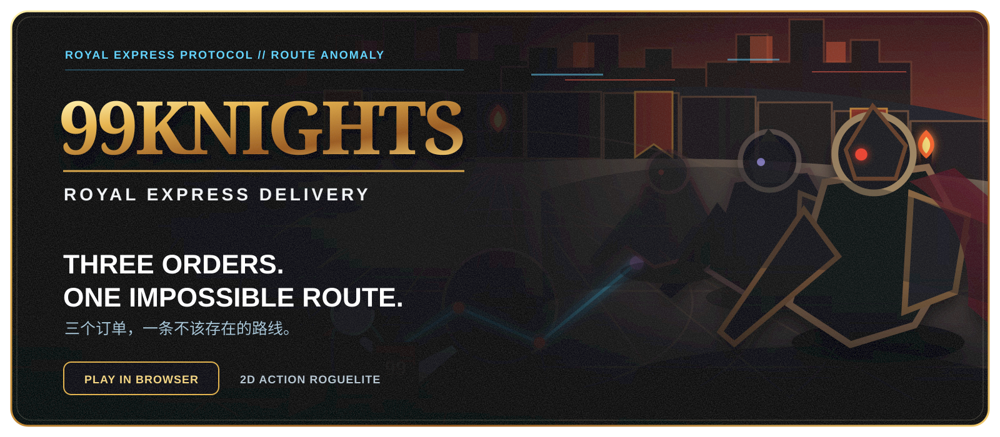

  

<h1 align="center">99Knights 2D</h1>

  <strong>Three orders. One family. One ordinary rider on a kingdom-ending route.</strong> 
  三个订单，一个家庭，一场被系统误判的末日任务。

  <a href="https://bigonewd.github.io/99Knights/"><strong>▶ Play in Browser / 立即试玩</strong></a>

<em>No download · No login · Runs entirely in your browser</em>

## About

**99Knights 2D** is a browser-based 2D arcade roguelite built around a 27-room delivery journey. An ordinary courier must fight through a Royal Delivery System that has mistaken three family orders for a kingdom-ending threat.

The complete illustrated v1.0 campaign runs as a self-contained HTML5 Canvas game with no backend or account requirement.

## Highlights

- **27-room campaign** across three delivery acts
- **Three boss encounters** with distinct reconciliation routes
- **Parry, posture, dodge and execution combat**
- **Chinese and bilingual dialogue modes**
- **Six illustrated story scenes** from protocol failure to family dinner
- **Campfire upgrades** and multiple warm endings
- **Local-only playtest reporting** unless the player exports a report

## Play

Open the live game:

### [https://bigonewd.github.io/99Knights/](https://bigonewd.github.io/99Knights/)

Desktop keyboard and mouse are recommended.

## Controls

| Action | Keyboard / Mouse |
|---|---|
| Move | `W` `A` `S` `D` |
| Light attack | `J` or left mouse button |
| Heavy attack | `K`, middle mouse button, or `Shift` + left click |
| Guard / early parry | `L` or right mouse button |
| Execute staggered enemy | `E` or right mouse button |
| Dodge | `Space` |
| Show hitboxes | `H` |

## Story

Morning coffee. Lunch shrimp fried rice. Evening salmon sushi.

The Royal Express Protocol sees three separate orders and declares a catastrophic operation. The courier gradually discovers that the routes all lead back to the same household—and that the most dangerous part of the mission may be the system itself.

## Current Release

**v1.0 — Illustrated Story Release**

- Complete 27-room narrative run
- Three redesigned bosses
- Bilingual dialogue and character portraits
- Six illustrated cutscenes
- Campfire sanctuary and upgrade flow
- Four family-centered endings

## Technical Notes

- Single-file HTML5 Canvas game
- No server-side runtime
- No database or cloud save
- Game assets and logic are embedded in `index.html`
- Hosted as a static site through GitHub Pages

## Feedback

Found a bug or have a balancing suggestion? Open a GitHub Issue and include:

- Browser and operating system
- Room or boss where it happened
- What you expected
- What actually happened
- A screenshot or exported playtest report, when available
